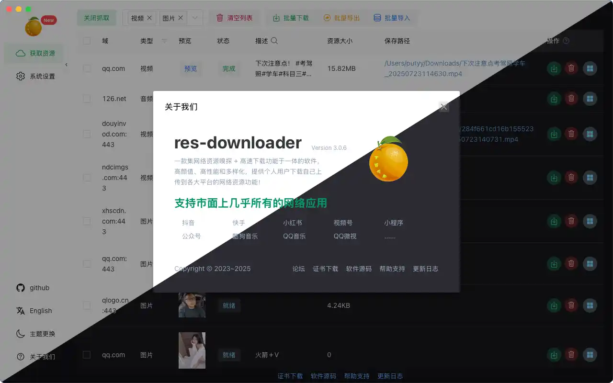

<div align="center">


# res-downloader-modified

<h4>📖 中文 | <a href="./README-EN.md">English</a></h4>


</div>

---

## 🌟 项目简介

`res-downloader-modified` 是基于 [putyy/res-downloader](https://github.com/putyy/res-downloader) 二次开发的**非官方修改版**。

原项目是一款基于 Go + [Wails](https://github.com/wailsapp/wails) 的跨平台资源下载工具，通过本地代理抓包的方式嗅探并下载可用资源。这个修改版在保留原有核心能力的基础上，加入了 Molly「沿途的风景」主题系统、明暗模式、自定义主题工坊以及更细腻的界面交互。

> 本修改版遵循 Apache License 2.0 发布；原始项目遵循 MIT License。请在使用、分发或二次开发前阅读 [LICENSE](./LICENSE) 与 [NOTICE](./NOTICE)。

## 🙏 致谢原项目

本项目基于 [putyy](https://github.com/putyy) 开发的 **res-downloader** 修改而来。感谢原作者持续维护这款开源工具，也感谢原项目为本修改版提供的基础能力。

- 原始仓库：[putyy/res-downloader](https://github.com/putyy/res-downloader)
- 原作者：putyy
- 原项目协议：MIT License

## 💝 修改版的由来

> *"Pure love never fails." —— 纯爱无敌*

这个修改版最初是我为一个暗恋的女孩做的。

她喜欢泡泡玛特的 Molly，尤其喜欢「沿途的风景」20 周年系列。我想，如果有一个工具，每次打开时都能看到那些温柔的颜色和 Molly 的笑脸，也许她使用时会开心一点。

于是，我在原版基础上加入了：

- 🎨 Molly「沿途的风景」主题系统，内置 11 款盲盒主题
- 🌗 全局亮色 / 暗色模式切换
- 🧪 自定义主题工坊
- ✨ 更丰富、更细腻的界面交互动效

后来，我没能把它送到她手里。

所以现在，我把这个修改版开源出来。希望这些颜色、主题和小小的心意，能让更多人使用时感到轻松一点。

*谨以此项目，纪念一段无疾而终的暗恋。纯爱无敌。*

---

## ✨ 功能特色

- 🚀 **简单易用**：界面清晰，操作流程直接，上手成本低
- 🖥️ **跨平台支持**：支持 Windows / macOS / Linux
- 🌐 **多资源类型**：支持视频、音频、图片、m3u8、直播流等资源嗅探与下载
- 📱 **广泛平台兼容**：支持微信视频号、小程序、抖音、快手、小红书、酷狗音乐、QQ 音乐等场景
- 🌍 **代理抓包**：通过本地代理捕获资源请求，适用于部分受限网络环境
- 🎨 **Molly 盲盒主题**：内置 11 款「沿途的风景」角色卡主题，并自动适配亮色 / 暗色模式
- 🌗 **全局明暗模式**：首页太阳 / 月亮按钮一键切换，切换主题时保留当前明暗模式
- 🧪 **自定义主题工坊**：可自定义主题名称、角色描述、角色图、主色、辅助色、强调色、提示色和 Molly 细节色
- ✨ **主题互动体验**：包含角色卡 hover 反馈、Molly 小挂件、主题色星点和全局细节动效

## 🎨 主题与自定义

- 进入 **系统设置 → 基础设置 → 盲盒主题**，可选择内置角色卡主题
- 进入 **系统设置 → 基础设置 → 自定义主题工坊**，可创建、编辑、删除个人主题
- 自定义主题会写入本地配置，重启软件后仍会保留
- 自定义主题同样支持亮色 / 暗色两套全局配色
- 主题图片资源位于 `frontend/src/assets/image/molly`

## 🛠️ 构建修改版

本仓库保留历史构建产物。推荐使用以下脚本构建：

```powershell
.\build-preserve.ps1
```

构建完成后会生成：

- `build/bin/res-downloader-modified.exe`
- `build/bin/res-downloader-modified_yyyyMMdd_HHmmss.exe`

带时间戳的历史版本不会被删除，便于回溯和备份。

## 📚 文档与版本

- 📘 [在线文档](https://res.putyy.com/)
- 💬 [加入交流群](https://www.putyy.com/app/admin/upload/img/20250418/6801d9554dc7.webp)
- 🧩 [最新版](https://github.com/putyy/res-downloader/releases) ｜ [Mini 版：使用默认浏览器展示 UI](https://github.com/putyy/resd-mini) ｜ [Electron 旧版：支持 Win7](https://github.com/putyy/res-downloader/tree/old)

> 群满时可添加微信 `AmorousWorld`，请备注 `github`。

## 🧩 下载地址

- 🆕 [GitHub 下载](https://github.com/putyy/res-downloader/releases)
- 🆕 [蓝奏云下载（密码：9vs5）](https://wwjv.lanzoum.com/b04wgtfyb)
- ⚠️ Win7 用户请下载 `2.3.0` 版本

## 🖼️ 预览



---

## 🚀 使用方法

请按以下步骤使用软件：

1. 安装时允许安装证书文件，并允许软件访问网络
2. 打开软件，在首页左上角点击 **启动代理**
3. 选择需要获取的资源类型，默认会捕获全部类型
4. 在外部打开目标资源页面，例如视频号、小程序或网页
5. 返回软件首页，即可查看捕获到的资源列表

## ❓ 常见问题

### 📺 m3u8 视频资源

- 在线预览：[m3u8play](https://m3u8play.com/)
- 视频下载：[m3u8-down](https://m3u8-down.gowas.cn/)

### 📡 直播流资源

- 推荐使用 [OBS](https://obsproject.com/) 录制直播流资源

### 🐢 下载慢或大文件下载失败？

- 可尝试使用以下下载工具：
  - [Neat Download Manager](https://www.neatdownloadmanager.com/index.php/en/)
  - [Motrix](https://motrix.app/download)
- 微信视频号资源下载后，可在操作项中点击 `视频解密（视频号）`

### 🧩 软件无法拦截资源？

请检查系统代理是否设置正确：

- 地址：`127.0.0.1`
- 端口：`8899`

### 🌐 关闭软件后无法上网？

- 手动关闭系统代理设置后重试

### 💡 更多问题

- [GitHub Issues](https://github.com/putyy/res-downloader/issues)
- [爱享论坛讨论帖](https://s.gowas.cn/d/4089)

## 💡 实现原理

本工具通过本地代理实现网络抓包，并从请求中筛选可用资源。它的原理与 Fiddler、Charles、浏览器 DevTools 类似，但对资源筛选、展示和处理做了更友好的封装，降低了普通用户的使用门槛。

---

## ⚠️ 免责声明

> 本软件仅供学习与研究使用，禁止用于任何商业或违法用途。
> 因使用本软件产生的任何法律责任，均由使用者自行承担，与作者无关。

## 📄 开源协议

本修改版基于 Apache License 2.0 发布；原始项目 [putyy/res-downloader](https://github.com/putyy/res-downloader) 基于 MIT License 发布。

完整协议内容请查看 [LICENSE](./LICENSE) 文件，原项目与修改说明请查看 [NOTICE](./NOTICE) 文件。
